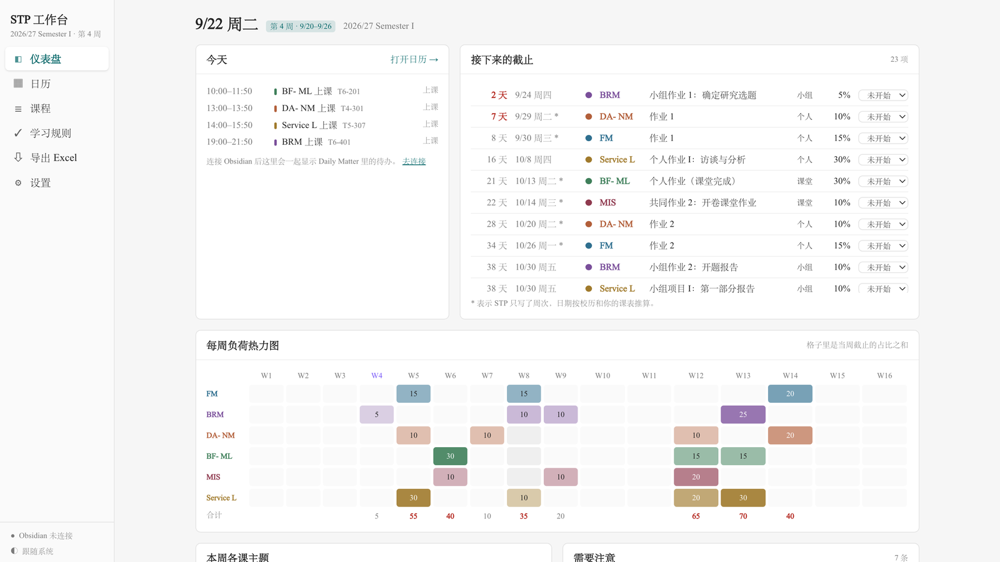

# STP 学期工作台

[](https://github.com/GloriaShang/stp-workbench/actions/workflows/deploy.yml)
[](LICENSE)


把每门课的 STP（Semester Teaching Plan）整理成**一张学期总表**和**一个会自己排学习计划的日历**，并和 Obsidian Day Planner 双向同步。

**👉 在线使用：https://gloriashang.github.io/stp-workbench/**



## 它能帮你做什么

- **截止日期一目了然**：6 门课的所有作业按时间排好，带倒计时。STP 只写了"第 N 周"的，按校历和你的课表推算出具体日期；几份资料写法不一致时，一律取更早的那个。
- **看清哪几周最忙**：每周负荷热力图按周汇总各门课的截止占比，第 12–13 周这种高峰一眼就能看出来。
- **日历上看课、看截止、写待办**：日 / 3 天 / 周 / 月视图。补课日（9/20 补周五、10/10 补周一）和国庆跨周已经处理好。
- **自动排学习计划**：勾选"课前预习、课后复习、提前 N 天完成作业、小组作业提前讨论和提交……"，排程器会避开上课时间和已有待办，把学习块排进空档。
- **和 Obsidian 双向同步**：在工作台里新建、拖动、勾选的待办直接写进你的 Daily Matter；在 Obsidian 里改的，几秒后工作台也会更新。
- **一键导出 Excel**：总览页、热力图，加上每门课一个工作表。语言、中英文字体、主题色都能自选。
- **数据只在你自己电脑上**：不需要注册账号，也不会上传到任何服务器。

## 三步开始

1. **打开**：用 Chrome 或 Edge 打开 https://gloriashang.github.io/stp-workbench/
2. **装到桌面**：点地址栏右侧的「安装」图标（带向下箭头的显示器）。之后工作台会出现在程序坞和启动台里，点图标就能打开，第一次打开后没网也能用。
3. **（可选）连接 Obsidian**：设置 → 选择 vault 文件夹 → 选你的 vault 根目录 → 允许读写。

不用 Obsidian 也能正常使用，待办会保存在工作台里。以后再连上 Obsidian 时，这些待办会自动搬进 Daily Matter。

## 功能一览

| 页面 | 能做什么 |
| --- | --- |
| **仪表盘** | 今天的课和待办（可以直接勾选）；接下来的截止和倒计时；每周负荷热力图；本周各课主题；需要注意的问题 |
| **日历** | 点时间轴空白处新建待办，点日期旁的「＋」新建当天待办；拖动改时间，拖底边改时长，点方框勾选。点日期数字只看那一天。待办按文字里提到的课程自动着色（如"FM 预习"显示为 FM 的颜色） |
| **课程** | 核对和编辑每门课的信息：上课时间、评分构成（支持嵌套）、每周教学计划、教材；可上传 STP 原文件方便对照 |
| **学习规则** | 课前预习、课后复习、提前 N 天完成 Individual Assignment、小组作业提前 N 天讨论和提前 N 天在 iSpace 提交、in-class assignment 提前 N 天复习、期末复习；可设置每天学习上限、哪天不排、哪门课更难 |
| **导出 Excel** | 中文 / English / 双语；中英文字体分开选；9 套主题色，另有自定义和色弱友好选项；实时预览 |
| **设置** | 连接 Obsidian、明暗模式、备份与恢复 |

## 与 Obsidian 同步

工作台读写 `00日程管理/Daily Matter/YYYY-MM-DD.md` 里的 `# Day planner` 段落，格式和 Day Planner 插件一样：

```markdown
# Day planner

- [ ] 13:30 - 13:40 DA-NM 课
- [x] 21:00 - 21:30 BF- ML 练习 + 笔记
- [ ] 雅思背单词
```

- **只改你动的那一行**，笔记里的其他内容原样保留。
- **不会覆盖你在 Obsidian 里的修改**：写入前会先重读文件，如果那一行已经被改过，就放弃写入并提示。
- **上课和截止只在工作台里显示**，不写进笔记；排程建议要点「采纳」后才写入。
- 每日笔记的路径、标题都可以在设置里改。

## 常见问题

**数据存在哪？会丢吗？**
存在浏览器里，关掉重开、过夜、重启电脑都不会丢。连上 Obsidian 后，还会自动备份到 `<vault>/.stp-workbench/`，并按天保留快照。

**换电脑、换浏览器、清了缓存怎么办？**
在新环境里重新连上同一个 vault，会提示"找到备份，要恢复吗？"，点确定就行。也可以在设置里手动导出或导入 JSON 备份。

**Safari 能用吗？**
能打开，但没法连接 Obsidian（Safari 不支持网页直接读写本地文件夹）。建议用 Chrome 或 Edge。

**为什么有些日期后面带 `*`？**
表示 STP 只写了周次，没写具体日期，这个日期是按校历和课表推算的，取该周最早的一次课。可以在「课程」页改成准确日期。

**页面一直开着，过了 0 点会更新吗？**
会自动切换到新的一天，不用刷新。

## 给其他同学用

内置的是 BNBU 2026/27 Semester I 校历和我这学期的 6 门课：FM（FIN3073）、BRM（BUS3023）、DA- NM（BA3033）、BF- ML（EBIS3113）、MIS（BUS4093）、Service L（GCAP3213）。

- **课不一样**：在「课程」页删掉不需要的课，新增自己的课，改上课时间、评分构成和截止日期。改动只保存在你自己的浏览器里。
- **换学期、换学校**：Fork 这个仓库，修改 `src/data/calendar.ts`（每周每天的实际上课日期、假期）和 `src/data/courses.ts`（内置课程），推送后 GitHub Actions 会自动部署到你自己的 Pages。

## 本地开发

```bash
npm install
npm run dev      # http://localhost:5173
npm run check    # 数据层自检：截止推算、校验、排程确定性、Excel 生成
npm run build    # 构建到 dist/
```

推送到 `main` 后，GitHub Actions 会自动构建并部署到 GitHub Pages（见 `.github/workflows/deploy.yml`）。

**技术栈**：React 19 · TypeScript · Vite · Tailwind CSS 4 · Zustand · ExcelJS · File System Access API · PWA

```
src/data/calendar.ts   校历：每周各个星期几的实际上课日期（已处理补课与假期）
src/data/courses.ts    内置课程数据（中英双语）
src/lib/dates.ts       日期工具、上课场次、截止日期推算
src/lib/validate.ts    占比合计、TBA、高压周等校验
src/lib/scheduler.ts   确定性排程器（同样的输入永远得到同样的结果）
src/lib/obsidian.ts    Daily Matter 的解析与逐行写入
src/lib/backup.ts      自动备份到 vault
src/lib/excel.ts       Excel 导出（用到时才加载 ExcelJS）
src/tasks.ts           待办统一入口：连了 Obsidian 写笔记，没连存本地
public/sw.js           离线缓存
```

## 许可

[MIT](LICENSE)
